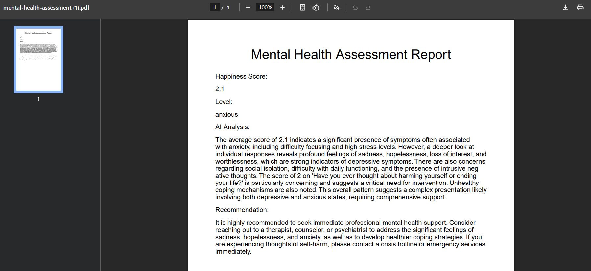

# 🧠 Mental Health Chatbot - RIPEX

<div align="center">


**A compassionate AI-powered mental health support system built with modern web technologies**

[](https://mentalhealthchatbotui.vercel.app/)
[](https://python.org)
[](https://reactjs.org)
[](https://fastapi.tiangolo.com)
[](LICENSE)

</div>

---

## 📋 Table of Contents

- [🎯 Problem Statement](#-problem-statement)
- [💡 Solution Approach](#-solution-approach)
- [🔧 Dependencies](#-dependencies)
- [🚀 Future Scope](#-future-scope)
- [💻 Local Development Setup](#-local-development-setup)
- [🌐 Deployment](#-deployment)
- [📱 Usage Guide](#-usage-guide)
- [⚡ Technology Stack](#-technology-stack)
- [🤝 Contributing](#-contributing)
- [👨‍💻 Authors](#-authors)
- [🙏 Acknowledgments](#-acknowledgments)

---

## 🎯 Problem Statement

Mental health issues have become increasingly prevalent in today's fast-paced world, with millions of people struggling with anxiety, depression, and other psychological challenges. Key problems identified:

- **Limited Access**: Mental health services are often expensive and geographically constrained
- **Stigma Barrier**: Many individuals hesitate to seek help due to social stigma
- **24/7 Availability**: Traditional therapy services have limited operating hours
- **Initial Assessment Gap**: People often don't know where to start their mental health journey
- **Resource Discovery**: Difficulty finding appropriate self-help resources and professional support

## 💡 Solution Approach

**RIPEX** (Resilience, Intelligence, Prevention, Empathy, eXcellence) is an AI-powered mental health chatbot that provides:

### 🎭 **Empathetic AI Companion**
- Powered by Google Gemini 2.5-flash model
- Trained specifically for mental health support conversations
- Provides philosophical advice and emotional support

### 📊 **Comprehensive Assessment Tools**
- Interactive mental health questionnaires
- Personalized scoring and recommendations
- Progress tracking and report generation

### 👩‍⚕️ **Healthcare Integration**
- Doctor directory with specialist listings
- Professional referral system
- Seamless transition from AI to human support

### 🔒 **Secure & Private**
- JWT-based authentication system
- Encrypted user data storage
- HIPAA-compliant security measures

## 🔧 Dependencies

### Backend Dependencies
```
fastapi>=0.116.1          # Modern, fast web framework
google-genai>=1.28.0       # Google Gemini AI integration
motor>=3.7.1               # MongoDB async driver
bcrypt==4.0.1              # Password hashing
python-jose>=3.5.0         # JWT token handling
pydantic[email]>=2.11.7    # Data validation
uvicorn[standard]>=0.35.0  # ASGI server
python-dotenv>=1.1.1       # Environment management
passlib[bcrypt]>=1.7.4     # Password utilities
```

### Frontend Dependencies
```
react: ^19.1.1             # UI framework
@mui/material: ^7.3.1      # Material-UI components
@mui/icons-material: ^7.3.1 # Material-UI icons
axios: ^1.11.0             # HTTP client
react-router-dom: ^7.7.1   # Routing
mobx: ^6.13.7              # State management
mobx-react: ^9.2.0         # MobX React bindings
@react-pdf/renderer: ^4.3.0 # PDF generation
lucide-react: ^0.537.0     # Icon library
```

## 🚀 Future Scope

### 🔮 **Planned Enhancements**

| Feature | Description | Priority |
|---------|-------------|----------|
| 🌍 **Multi-language Support** | Expand to support multiple languages for global accessibility | High |
| 📱 **Mobile Application** | Native iOS and Android apps with offline capabilities | High |
| 🎯 **Advanced Analytics** | ML-powered mood tracking and predictive analytics | Medium |
| 🤖 **Voice Integration** | Voice-based conversations and speech therapy modules | Medium |
| 👥 **Group Therapy** | Virtual group sessions and peer support communities | Medium |
| 🔗 **API Integrations** | Integration with wearables and health monitoring devices | Low |
| 🎨 **Personalization** | Customizable UI themes and conversation styles | Low |

### 📈 **Technical Roadmap**
- **Phase 1**: Enhanced AI model training with specialized mental health datasets
- **Phase 2**: Real-time crisis detection and emergency response system  
- **Phase 3**: Integration with electronic health records (EHR) systems
- **Phase 4**: Blockchain-based secure health data management

## 💻 Local Development Setup

### Prerequisites
- **Python 3.9+**
- **Node.js 16+**
- **MongoDB** (or MongoDB Atlas account)
- **Google AI Studio API Key**

### Backend Setup

1. **Clone the repository**
   ```bash
   git clone https://github.com/samriddha2003/Mental_Health_Project_Final_year.git
   cd Mental_Health_Project_Final_year/mentalhealthchatbotbackend-main
   ```

2. **Create virtual environment**
   ```bash
   python -m venv venv
   source venv/bin/activate  # On Windows: venv\Scripts\activate
   ```

3. **Install dependencies**
   ```bash
   pip install -r requirements.txt
   ```

4. **Environment configuration**
   Create `.env` file:
   ```env
   GOOGLE_AI_API_KEY=your_gemini_api_key_here
   MONGODB_URL=mongodb://localhost:27017/mental_health
   JWT_SECRET_KEY=your_super_secret_jwt_key
   JWT_ALGORITHM=HS256
   ```

5. **Start the backend server**
   ```bash
   uvicorn app.main:app --reload --port 8000
   ```
   🌐 Backend will be available at: `http://localhost:8000`

### Frontend Setup

1. **Navigate to frontend directory**
   ```bash
   cd ../mentalhealthchatbotui-main
   ```

2. **Install dependencies**
   ```bash
   npm install
   ```

3. **Environment configuration**
   Create `.env.local` file:
   ```env
   REACT_APP_API_BASE_URL=http://localhost:8000
   ```

4. **Start the development server**
   ```bash
   npm start
   ```
   🌐 Frontend will be available at: `http://localhost:3000`

## 🌐 Deployment

### 🚀 Live Application

**Production URL**: [https://mentalhealthchatbotui.vercel.app/](https://mentalhealthchatbotui.vercel.app/)

### 🏗️ Deployment Architecture

- **Frontend**: Deployed on **Vercel** with automatic CI/CD
- **Backend**: Containerized deployment with **Docker** support
- **Database**: **MongoDB Atlas** for production data storage
- **AI Service**: **Google Cloud AI Platform** integration

### 📱 Application Screenshots

#### 🎭 **Chatbot Interface**

*Clean, intuitive chatbot interface with "Start a conversation..." prompt, ready for user interaction with RIPEX AI assistant*

#### 📋 **Mental Health Assessment**

*Interactive mental health questionnaire featuring multiple-choice questions with options ranging from "Rarely or Not at all" to "Constantly or Severe"*

#### 📊 **Assessment Results & Doctor Directory**

*Comprehensive assessment results showing happiness score (2.1/5), detailed AI analysis, professional recommendations, and integrated doctor directory with specialist listings*

#### 📄 **Professional Mental Health Report**

*Auto-generated PDF report containing comprehensive mental health assessment results including happiness score (2.1), anxiety level classification, detailed AI analysis of symptoms, and professional recommendations for immediate mental health support. The report provides a complete clinical overview suitable for healthcare professionals and personal records.*

### 📦 Docker Deployment (Optional)

```bash
# Backend
cd mentalhealthchatbotbackend-main
docker build -t mental-health-backend .
docker run -p 8000:8000 mental-health-backend

# Frontend  
cd mentalhealthchatbotui-main
docker build -t mental-health-frontend .
docker run -p 3000:3000 mental-health-frontend
```

## 📱 Usage Guide

### 🔐 **Getting Started**

1. **Registration**: Create an account with email, password, age, and blood type
2. **Authentication**: Secure login with JWT token management
3. **Dashboard**: Access main features through intuitive navigation

### 💬 **Chatbot Interaction**

- **Start Conversation**: Click on "Chat with RIPEX" to begin
- **Natural Language**: Type your thoughts, concerns, or questions naturally
- **Empathetic Responses**: RIPEX provides supportive, professional guidance
- **Resource Suggestions**: Receive recommendations for books, videos, and articles
- **Session Management**: Reset conversations or continue from where you left off

### 📋 **Health Assessment**

- **Interactive Questionnaire**: Complete comprehensive mental health evaluation
- **Personalized Scoring**: Receive detailed analysis of your responses  
- **PDF Reports**: Download professional assessment reports for personal records or healthcare providers
- **Progress Tracking**: Monitor your mental health journey over time

### 📄 **Report Generation Features**

The system automatically generates comprehensive mental health assessment reports that include:

- **Quantitative Scoring**: Numerical happiness score with clear interpretation
- **Symptom Classification**: Professional categorization (e.g., anxiety levels)
- **AI-Powered Analysis**: Detailed interpretation of assessment responses using advanced AI
- **Clinical Recommendations**: Evidence-based suggestions for professional intervention
- **Crisis Support Information**: Emergency contact details and immediate help resources
- **Professional Format**: Clinical-grade documentation suitable for healthcare providers

### 👩‍⚕️ **Doctor Directory**

- **Specialist Search**: Find qualified mental health professionals
- **Profile Information**: View credentials, specializations, and contact details
- **Appointment Booking**: Direct integration with healthcare providers

## ⚡ Technology Stack

<div align="center">

### 🏗️ **Architecture Overview**


</div>

### 🖥️ **Frontend Technologies**

| Technology | Version | Purpose |
|------------|---------|---------|
| ⚛️ **React** | 19.1.1 | Core UI framework with hooks |
| 🎨 **Material-UI** | 7.3.1 | Modern component library |
| 🔄 **MobX** | 6.13.7 | Reactive state management |
| 🌐 **React Router** | 7.7.1 | Client-side routing |
| 📡 **Axios** | 1.11.0 | HTTP client for API calls |
| 📄 **React PDF** | 4.3.0 | PDF report generation |

### 🖧 **Backend Technologies**

| Technology | Version | Purpose |
|------------|---------|---------|
| ⚡ **FastAPI** | 0.116.1+ | High-performance web framework |
| 🤖 **Google Gemini** | 2.5-flash | AI conversation engine |
| 🗄️ **MongoDB** | Latest | NoSQL database via Motor |
| 🔐 **JWT** | 3.5.0+ | Authentication & authorization |
| 🛡️ **bcrypt** | 4.0.1 | Password hashing |
| ✅ **Pydantic** | 2.11.7+ | Data validation & serialization |

### 🔧 **Development & DevOps**

- **Package Management**: npm, pip, uv
- **Version Control**: Git & GitHub
- **Deployment**: Vercel (Frontend), Docker (Backend)
- **API Documentation**: FastAPI Swagger UI
- **Testing**: React Testing Library, pytest
- **Code Quality**: ESLint, Prettier, Black

## 🤝 Contributing

We welcome contributions from the community! Here's how you can help:

### 🐛 **Bug Reports**
- Use GitHub Issues to report bugs
- Include detailed reproduction steps
- Provide system information and screenshots

### ✨ **Feature Requests**
- Propose new features through GitHub Discussions
- Explain the use case and potential impact
- Consider implementation complexity

### 💻 **Code Contributions**

1. **Fork the repository**
2. **Create feature branch**: `git checkout -b feature/amazing-feature`
3. **Commit changes**: `git commit -m 'Add amazing feature'`
4. **Push to branch**: `git push origin feature/amazing-feature`
5. **Open Pull Request** with detailed description

### 📋 **Development Guidelines**

- Follow existing code style and conventions
- Write comprehensive tests for new features
- Update documentation for significant changes
- Ensure all tests pass before submitting PR

## 👨‍💻 Authors

<div align="center">

| **Samriddha Das** |
|:---:|
|  |
| **Lead Developer & Project Architect** |
| [](https://github.com/samriddha2003) |
| *Full-stack developer specializing in AI integration and modern web technologies* |

</div>

### 🎓 **Project Role**
- **System Architecture**: Designed scalable FastAPI backend with microservices approach
- **AI Integration**: Implemented Google Gemini chatbot with mental health specialization  
- **Frontend Development**: Built responsive React UI with Material-UI components
- **Database Design**: Structured MongoDB schema for user management and conversation history
- **DevOps**: Configured deployment pipeline and production infrastructure

## 🙏 Acknowledgments

### 🎯 **Special Thanks To**

- **Google AI Team** - For providing access to the powerful Gemini AI model
- **FastAPI Community** - For excellent documentation and framework support  
- **Material-UI Team** - For beautiful, accessible React components
- **Mental Health Professionals** - For guidance on ethical AI in healthcare
- **Beta Testers** - For valuable feedback and feature suggestions

### 📚 **Educational Resources**

- **Mental Health First Aid** - Training guidelines for AI response development
- **WHO Mental Health Guidelines** - International standards for mental health support
- **IEEE AI Ethics Standards** - Framework for responsible AI development
- **HIPAA Compliance Guide** - Healthcare data protection regulations

### 🌟 **Open Source Libraries**

This project is built on the shoulders of giants. We're grateful to all the open-source contributors who made this possible:

- React.js Community
- FastAPI & Starlette
- MongoDB & Motor Driver
- Python Ecosystem (Pydantic, bcrypt, python-jose)
- Node.js & npm Registry

---

<div align="center">

### 💝 **Made with ❤️ for Mental Health Awareness**

**If you or someone you know is in crisis, please contact your local emergency services or:**
- **National Suicide Prevention Lifeline**: 988
- **Crisis Text Line**: Text HOME to 741741
- **International Association for Suicide Prevention**: [https://www.iasp.info/resources/Crisis_Centres/](https://www.iasp.info/resources/Crisis_Centres/)

---

**⭐ Star this repository if you found it helpful!**

[](https://github.com/samriddha2003/Mental_Health_Project_Final_year/stargazers)

</div>
